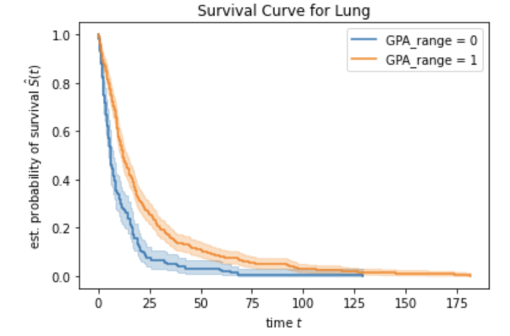

## Prelude:

As part of our coursework at USF, we are supposed to complete nine month's practicum. We were always interested in applying Deep Learning to solve problems in the healthcare space which led me to our internship at UCSF.

### Project 1 Survival Analysis:

#### Background

Clinicians use DS - GPA(Diagnosis-specific Graded Prognostic Assessment) model to segment patients by cancer severity to better inform the treatment decision they need to take. However, there were a few problems with this model. 

1) patients lived far longer than predicted by the model. 
2) Additionally, there was a significant overlap in the patient survival times between the GPA classes.

We needed to apply the DS GPA model to our dataset and develop a new DS-GPA model to replace the existing one.

#### What we did:
We had data on 8k patients that had developed metastatic brain cancer and their demographic information( age, sex etc) and their disease presentation metrics( such as the size of the tumor)

We used a decision tree classifier to segment the patients by survival times and Kaplan Meier curve curves to check the separation between the classes.

#### LUNG DS GPA Model

#### Original

#### New
##### 2 Classes

##### 3 Classes

