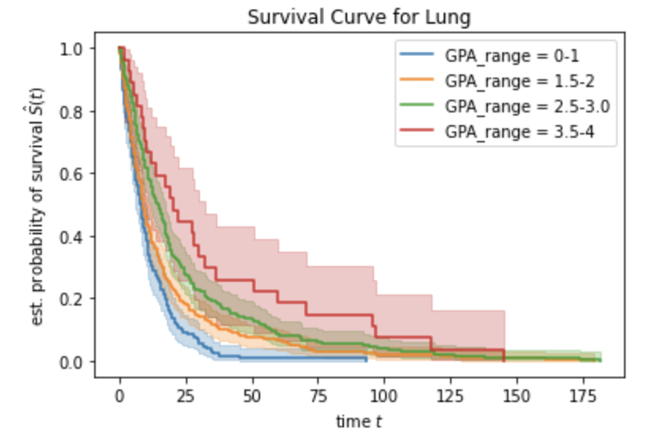
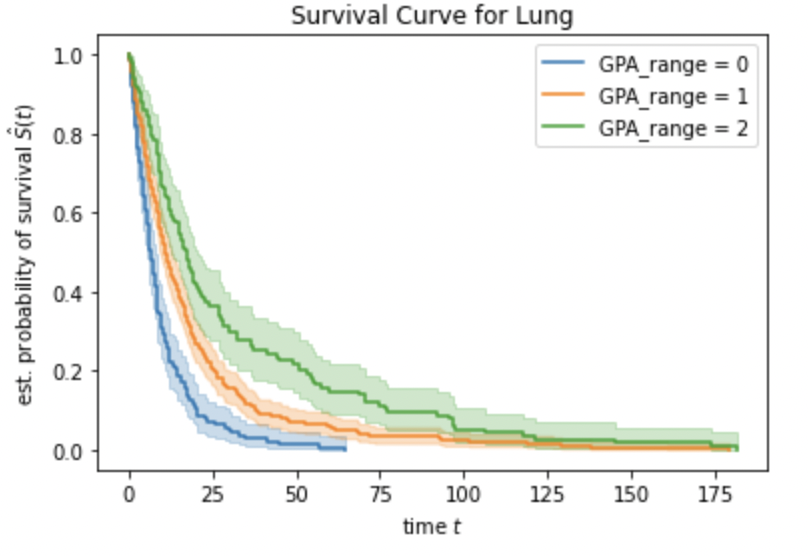

### MOTIVATION:

This project was executed as a part of our internship at UCSF.
Superduto et all had developed a clincal methodology(Diagnosis-specific Graded Prognostic Assessment) to segment patients by the severity of the cancer such that they have well separated survival times and develop an estimated time for each patient. However, the data found at UCSF was found not to follow what Superduto had predicted:

1) patients lived far longer than predicted 
2) Additionally, there was a significant overlap in the patient survival times between the GPA classes.

Our objective was to update the methodology that Superduto had proposed 

### DATASET

Tabular data of patients suffereing from Brain Metastatic Cancer and clinical attributes of the patients such as Age, Sex etc.

The target variable was time of death 

#### MODEL:

We used a decision tree model to predict the time of death. The predictions from the model were used to decide which classes the patient belonged to. For instance, if the tree predicted two leaves, the patient belonging to the leaf node with a lower mean survival time would be assigned class zero and the patient belonging to the other leaf node class one.

We then fit a Kaplan Meier Survival curve on the class produced by the tree in order to see a graphical/statistical seperation of survival between the groups predicted

#### LUNG CANCER

#### ORIGINAL

#### OUR MODEL

##### 3 Classes

